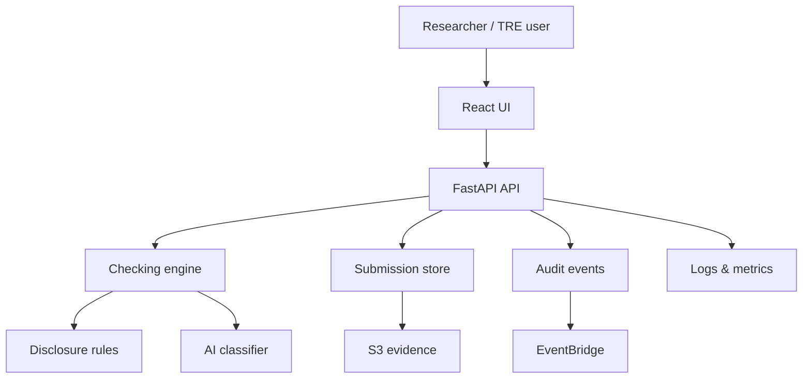

# SafeOutputs AI

**Short description:** An AI-ready trusted research output checking prototype that screens researcher export files for disclosure risk before release.

SafeOutputs AI is a portfolio-ready prototype inspired by trusted research environment output checking. It demonstrates how a cloud-native platform could help researchers submit files for automated safety review before export.

The project is designed to align with UK Biobank's Automated Output Checking System role:

- Python/FastAPI backend with secure API patterns.
- React and TypeScript frontend for reviewer workflows.
- Rule-based and AI-ready risk scoring pipeline.
- Event-driven architecture notes and audit trail concepts.
- AWS-oriented Terraform skeleton.
- CI pipeline for backend tests and frontend build checks.

## Architecture



## Features

- Submit an export candidate with file metadata and text preview.
- Score risk using disclosure-oriented checks for direct identifiers, small cell counts, genomic references, and sensitive terms.
- Return an explainable decision: `approved`, `review_required`, or `blocked`.
- Browse review history in the frontend.
- Keep every assessment auditable with timestamps and check evidence.

## Quick Start

### Backend

```bash
cd backend
python3 -m venv .venv
source .venv/bin/activate
pip install -e ".[dev]"
uvicorn app.main:app --reload --port 8000
```

### Frontend

```bash
cd frontend
bun install
bun run dev
```

The frontend expects the API at `http://localhost:8000`.

## Repository Layout

```text
backend/          FastAPI application and tests
frontend/         React TypeScript dashboard
infra/terraform/  AWS infrastructure skeleton
docs/             Architecture and implementation notes
samples/          Example export candidates
```
